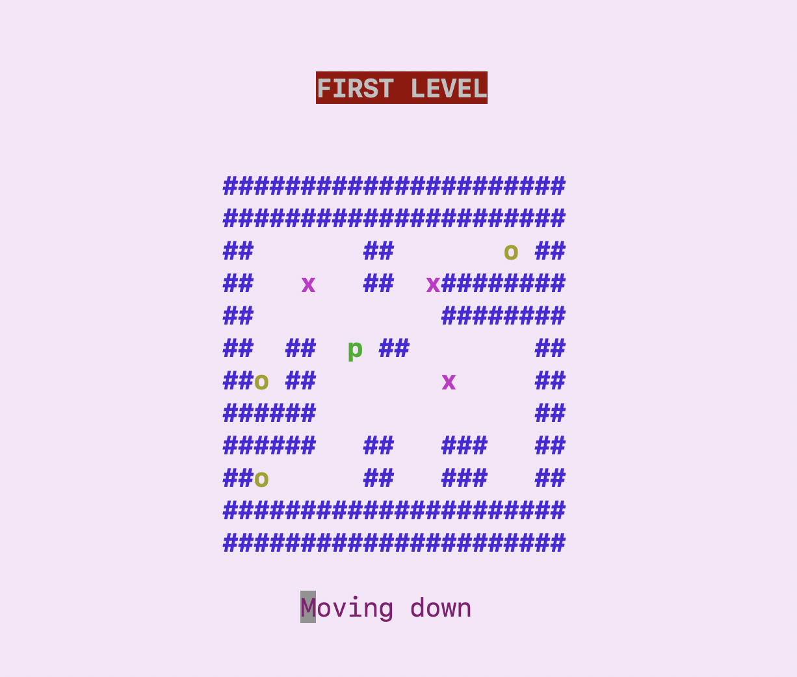
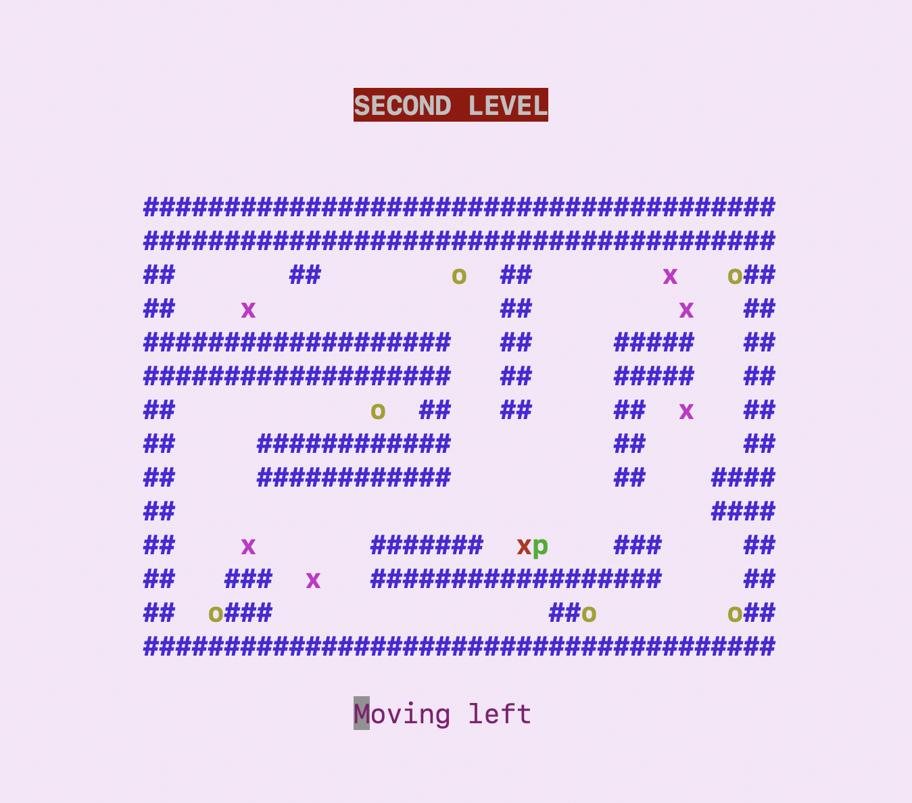

# Sokoban
A basic terminal-based game sokoban using C

[](LICENSE)


## Preview ⭐️
### First Level
  
 
### Second Level
 


## Requirements 🔧
This terminal game is compatible with the systems under Unix: Linux, macOS, Ubuntu.


## Installation 🔌

1. Press the **Code** button (top right the page) to copy the ssh key of this project.

2. Clone this project by typing in the bash the following command:

       git clone git@github.com:SitaraLiang/Sokoban.git

3. For starting the game directly through terminal:

    ```
    % make
    ```
    ```
    % ./main
    ```


## Playing 💡
### Operation keys
| Keys     |  Description      | 
|--------- |-------------------|
|    w     |   Moving up        | 
|    a     |    Moving left      | 
|    s     |    Moving down      | 
|    d     |    Moving right     | 
|    r     |    Restart          | 
|    q     |    Quit             |


## Organisation du projet 🛠️
For the implementation of the game, the project is divided into several files, where `main.c` contains only the control of the game and IO commands.

- `lib/` contains macros and header functions to make the code more readable and concise
    - map.h
    - operation.h
    - player.h
    - base.h

- `src/`contains the implementation of different functions of the game
    - map.c
    - operation.c
    - main.c


### Structures of datas
The project contains a structure of map and a structure of player. To better characterize the player and the map, the project contains other two enumerations: one for storing all the necessary characters we used to design the grid of map, and another for storing all the key the player uses to control the game (move, restart or quit the game).

#### player (structure)
|||
|--|--|
|pos_x| *The column of the player's current position* |
|pos_y| *The row of the player's current position* |

#### map (structure)
|   |        | 
|--------- |-------------------|
|   grid     |    *2D array containing the entities present in the game*        | 
|   player     |    *The object of player*      | 
|   number of columns     |  *Total number of map columns*      | 
|    number of rows       |  *Total number of map rows*     | 

#### Characters (enum)
|   |        | |
|--------- |-----|-------------------|
|WALL|'#'| *Symbol of wall, player and boxes cannot cross the wall*|
|BOX|'x'| *The box symbol that changes color when a goal is reached*|
|PLAYER|'p'| *Symbol of player*|
|OPEN_GOAL|'o'| *The goal that doesn't have a box in it*|
|CLOSED_GOAL|'*'| *The goal that already has a box in it* |
|NONE|' '| *Areas where player and boxes can move*|

#### Direction (enum)
|   |    | 
|---------|-------------------|
|UP|'w'|
|LEFT|'a'|
|DOWN|'s'|
|RIGHT|'d'|
|RESTART|'r'|
|QUIT|'q'|

## Thank You ☕️
This is my first C project in school, a very simple terminal game using basic features of language C and ncurses library. There are many shortcomings and areas for improvement. Any suggestions for the game are welcome! :)
